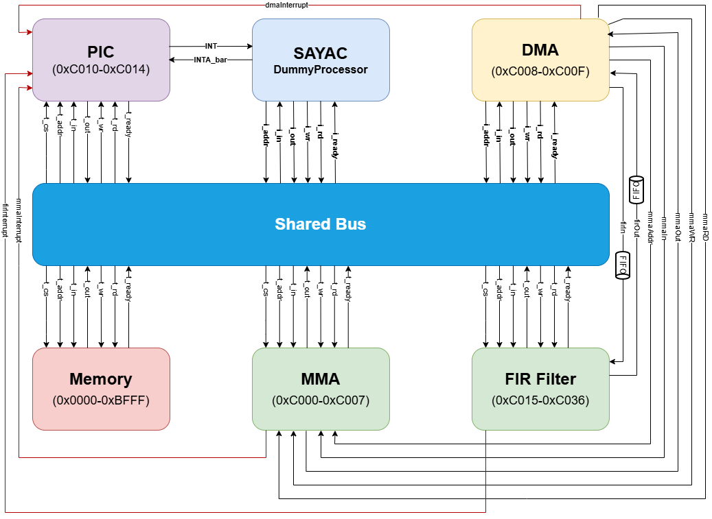
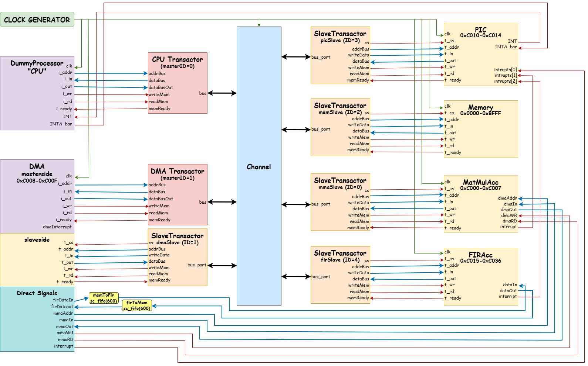

# SAYAC FIR Accelerator

SystemC implementation of a 31-tap FIR filter accelerator integrated into the SAYAC embedded system, with DMA-based data transfer, interrupt handling, bus and channel-based communication, and software-controlled audio processing.

## Overview

This project extends the **SAYAC embedded system** with a hardware-modelled **Finite Impulse Response (FIR) filter accelerator** for audio signal processing.

The system is modeled using **SystemC** and follows a hardware/software co-design approach. The processor is modeled using a C++-based behavioral model, while the FIR accelerator, DMA controller, memory, interrupt controller, bus, and channel-based communication are modeled as SystemC components.

The project processes a noisy audio signal through the following stages:

1. Load the noisy audio samples and FIR coefficients into memory.
2. Configure the FIR accelerator.
3. Transfer audio samples from memory to the FIR accelerator using DMA.
4. Process the samples in chunks using the 31-tap FIR filter.
5. Transfer the filtered samples back to memory using DMA.
6. Generate two additional versions of the filtered signal:

   * `filtered_x2`: half-rate output
   * `filtered_half`: double-rate output
7. Validate the generated results against an independent software reference implementation.
8. Convert the processed samples back into WAV files for listening and comparison.

The system is implemented in two communication configurations:

* **Bus Interface**
* **Channel Interface**

The channel-based implementation abstracts the wired bus communication using SystemC channels and transactors.

---

## System Architecture

The complete system contains the following major components:

* **Dummy Processor**
* **Memory**
* **Bus / Channel Interface**
* **DMA Controller**
* **FIR Accelerator**
* **MMA Accelerator**
* **Programmable Interrupt Controller (PIC)**
* **SystemC FIFO Channels**

The processor performs system control, configuration, synchronization, and software-based signal processing where required. The FIR accelerator performs the computationally intensive filtering operation, while the DMA controller handles data movement between memory and accelerators.

### Bus-Based Architecture

The bus implementation connects the processor and peripheral modules through the original SAYAC-style memory-mapped bus.



### Channel-Based Architecture

The channel implementation replaces the direct wired bus communication with a channel-based communication structure using transactors.



The channel implementation uses:

* `busChannel`
* `Transactor`
* `SlaveTransactor`
* SystemC interfaces and channel abstractions

This allows the communication and handshaking behavior of the bus to be abstracted within channels.

---

## FIR Accelerator

The FIR accelerator is implemented as a **Bus Functional Model (BFM)**. From the system's perspective, it behaves like a memory-mapped hardware accelerator, while its internal computation is implemented using C++.

The filter contains **31 taps** and processes the input signal in chunks of up to **512 samples**.

### Memory-Mapped Registers

The FIR accelerator uses 34 memory-mapped registers:

| Register | Description                                         |
| -------- | --------------------------------------------------- |
| `0`      | Control — starts the filtering operation            |
| `1`      | Status — indicates completion                       |
| `2`      | Chunk Size — number of samples in the current chunk |
| `3–33`   | FIR filter coefficients                             |

The accelerator also provides:

* Memory-mapped configuration interface
* FIFO input interface
* FIFO output interface
* Interrupt output to the PIC

The input and output samples are transferred through SystemC predefined FIFO channels.

### FIR Processing Flow

For every processing chunk, the accelerator:

1. Waits for the start command.
2. Determines the current chunk size.
3. Reads the samples from the input FIFO.
4. Prepends the required history samples from the previous chunk.
5. Performs the 31-tap FIR convolution.
6. Applies fixed-point scaling.
7. Saturates the result to the signed 16-bit range.
8. Writes the filtered samples to the output FIFO.
9. Updates the history buffer for the next chunk.
10. Sets the completion status.
11. Generates an interrupt.

Because consecutive chunks are part of the same continuous audio signal, the accelerator keeps the last **30 samples** of each chunk and uses them when processing the next chunk.

---

## DMA Controller

The DMA controller is responsible for transferring data between memory and accelerators without requiring the processor to manually transfer every sample.

In this implementation, DMA can communicate with both:

* **MMA**
* **FIR**

The destination accelerator is selected through the DMA control register.

For FIR processing, DMA uses SystemC FIFO channels:

```text
Memory → DMA → FIR Input FIFO
FIR Output FIFO → DMA → Memory
```

This allows the processor to focus on configuration and synchronization while the DMA handles the actual data movement.

---

## Interrupt Handling

The system uses a **Programmable Interrupt Controller (PIC)** to manage interrupts generated by system components.

The interrupt sources are configured as:

| Interrupt ID | Source |
| -----------: | ------ |
|          `1` | DMA    |
|          `2` | MMA    |
|          `3` | FIR    |

The processor waits for interrupts and identifies their source through the PIC before continuing the corresponding part of the processing flow.

---

## Memory Map

The final system uses the following memory map:

| Module | Start Address | End Address |           Size |
| ------ | ------------: | ----------: | -------------: |
| Memory |      `0x0000` |    `0xBFFF` | 50,000 entries |
| MMA    |      `0xC000` |    `0xC007` |    8 registers |
| DMA    |      `0xC008` |    `0xC00F` |    8 registers |
| PIC    |      `0xC010` |    `0xC014` |    5 registers |
| FIR    |      `0xC015` |    `0xC036` |   34 registers |

The memory size was increased to accommodate the generated audio data, particularly the double-rate output.

---

## Audio Processing

The provided noisy audio signal contains **22,050 samples**.

The processing pipeline is:

```text
noisy.wav
    │
    ▼
 WAV → TXT
    │
    ▼
 Memory
    │
    ▼
 DMA
    │
    ▼
 FIR Accelerator
    │
    ▼
 DMA
    │
    ▼
 Filtered Audio
    ├───────────────┐
    │               │
    ▼               ▼
  x2 Processing   Half Processing
    │               │
    ▼               ▼
 filtered_x2     filtered_half
```

### FIR Filtering

The processor first loads the 31 filter coefficients from memory and writes them into the FIR accelerator's coefficient registers.

The audio samples are then processed in blocks. For each block:

```text
Memory
   │
   │ DMA
   ▼
FIR Input FIFO
   │
   ▼
FIR Accelerator
   │
   ▼
FIR Output FIFO
   │
   │ DMA
   ▼
Memory
```

After all blocks have been processed, the filtered samples are extracted from memory.

---

## Sample-Rate Processing

After FIR filtering, two additional versions of the audio are generated.

### `filtered_x2`

In the implementation used in this project, this stage reduces the number of samples by half.

Every other sample is removed:

```text
Input:
S0 S1 S2 S3 S4 S5 ...

Output:
S0 S2 S4 ...
```

The number of samples therefore changes from:

```text
22,050 → 11,025
```

This operation is performed entirely by the processor without using the FIR, DMA, MMA, or PIC for computation.

### `filtered_half`

This stage doubles the number of samples by inserting the average of consecutive samples between them.

For example:

```text
A       B       C
 \     / \     /
  Avg 1   Avg 2
```

Conceptually:

```text
A B C
```

becomes:

```text
A (A+B)/2 B (B+C)/2 C
```

The resulting number of samples is:

```text
22,050 → 44,100
```

The operation is performed from the end of the buffer toward the beginning so that the data can be expanded in-place without overwriting samples that have not yet been processed.

---

## Bus vs. Channel Implementation

The project contains two versions of the complete system.

### Bus Interface

Located in:

```text
systems/System with bus interface/
```

This version uses the original wired bus structure and memory-mapped communication.

### Channel Interface

Located in:

```text
systems/System with channel interface/
```

This version abstracts bus communication using SystemC channels and transactors.

The channel implementation required additional synchronization handling because the original bus implementation checked signals on clock edges, while the channel implementation relies more heavily on event-based sensitivity.

In particular, additional `wait()` operations were required in several modules to prevent short-lived signal changes from being missed during SystemC delta-cycle updates.

The affected components include:

* DMA
* FIR
* PIC
* Dummy Processor
* Channel transactors
* System-level channel connections

This difference was especially important for interrupt and handshake signals.

---

## Verification

The project includes an independent software reference implementation in:

```text
validate/
```

The reference program performs:

* FIR filtering
* Half-rate processing
* Double-rate processing

using software-only algorithms.

The outputs generated by the SystemC system can be compared with the reference outputs using the Linux `diff` command.

For example:

```bash
diff <system_output.txt> <reference_output.txt>
```

An empty result indicates that the compared files contain no differences.

This provides an independent way to verify the functional correctness of the SystemC implementation.

---

## Audio Conversion

The `converter/` directory contains utilities for converting between audio files, text samples, and binary representations.

### WAV → TXT

Located in:

```text
converter/wav_to_txt/
```

Converts the input WAV file into integer audio samples.

### Decimal → Two's Complement Binary

Located in:

```text
converter/dec_to_bin/
```

Converts decimal sample values and coefficients into the two's-complement binary representation used for memory initialization.

### TXT → WAV

Located in:

```text
converter/txt_to_wav/
```

Converts processed sample data back into a WAV audio file.

---

## Repository Structure

```text
sayac-fir-accelerator/
│
├── audio/
│   └── noisy.wav
│
├── converter/
│   ├── dec_to_bin/
│   │   ├── coefficients.txt
│   │   ├── dec_to_bin.cpp
│   │   └── noisy.txt
│   │
│   ├── txt_to_wav/
│   │   └── txt_to_wav.cpp
│   │
│   └── wav_to_txt/
│       ├── noisy.txt
│       ├── noisy.wav
│       └── wav_to_txt.cpp
│
├── docs/
│   ├── diagrams/
│   │   ├── system_diagram_bus_interface.drawio.png
│   │   └── system_diagram_channel_interface.drawio.png
│   ├── Discription.pdf
│   ├── Filter Only Part.pdf
│   └── RTL IP Cores FIR Filter.pdf
│
├── systems/
│   ├── System with bus interface/
│   │   ├── filtered/
│   │   ├── filtered_half/
│   │   └── filtered_x2/
│   │
│   └── System with channel interface/
│       ├── filtered/
│       ├── filtered_half/
│       └── filtered_2x/
│
├── validate/
│   ├── coefficients.txt
│   ├── noisy.txt
│   └── reference_filter.cpp
│
└── README.md
```

### Directory Description

| Directory    | Purpose                                            |
| ------------ | -------------------------------------------------- |
| `audio/`     | Input audio data                                   |
| `converter/` | Audio and data-format conversion utilities         |
| `docs/`      | Project reports and architecture diagrams          |
| `systems/`   | Complete SystemC implementations                   |
| `validate/`  | Independent software reference and validation data |

The `systems/` directory contains separate implementations for the different processing scenarios and communication architectures.

---

## Technologies

* **C++**
* **SystemC**
* **SystemC FIFO Channels**
* **Object-Oriented Modeling**
* **Bus Functional Modeling (BFM)**
* **DMA**
* **FIR Filtering**
* **Memory-Mapped Interfaces**
* **Interrupt-Based Synchronization**
* **Linux**

---

## Project Documentation

Additional documentation is available in the `docs/` directory:

* `Discription.pdf` — project description
* `Filter Only Part.pdf` — FIR-related documentation
* `RTL IP Cores FIR Filter.pdf` — FIR filter reference material
* `diagrams/` — system architecture diagrams

The complete project report is also included in the documentation files.

---

## Project Flow

The overall implementation can be summarized as:

```text
                 ┌─────────────────────┐
                 │     Noisy Audio      │
                 │      22,050 samples  │
                 └──────────┬──────────┘
                            │
                            ▼
                 ┌─────────────────────┐
                 │       Memory        │
                 └──────────┬──────────┘
                            │
                            │ DMA
                            ▼
                 ┌─────────────────────┐
                 │   FIR Accelerator   │
                 │      31 Taps        │
                 └──────────┬──────────┘
                            │
                            │ DMA
                            ▼
                 ┌─────────────────────┐
                 │       Memory        │
                 │   Filtered Signal   │
                 └───────┬─────┬───────┘
                         │     │
                 ┌───────┘     └────────┐
                 ▼                       ▼
        ┌─────────────────┐     ┌─────────────────┐
        │  filtered_x2    │     │ filtered_half   │
        │  11,025 samples │     │ 44,100 samples  │
        └────────┬────────┘     └────────┬────────┘
                 │                       │
                 └───────────┬───────────┘
                             ▼
                    ┌─────────────────┐
                    │     Validate    │
                    │ Software Ref.   │
                    └─────────────────┘
```

---

## Academic Context

This project was developed as a final take-home project for the **Object-Oriented Modeling of Electronic Circuits** course at the **University of Tehran**.

The implementation extends the provided SAYAC embedded-system model with a FIR accelerator, DMA-based data transfer, processor-controlled signal processing, and both bus- and channel-based communication architectures.

The project focuses on modeling the interaction between software-controlled processing and hardware-like SystemC components rather than implementing the accelerator as synthesizable RTL hardware.

---

## Author

**Ali Dehghani**

Computer Engineering
University of Tehran

---

## License

This repository is primarily an academic project and is provided for educational and reference purposes.
